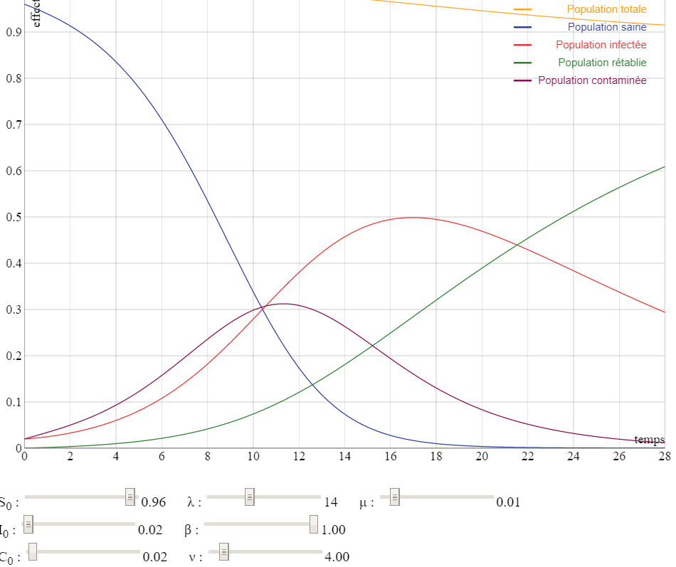
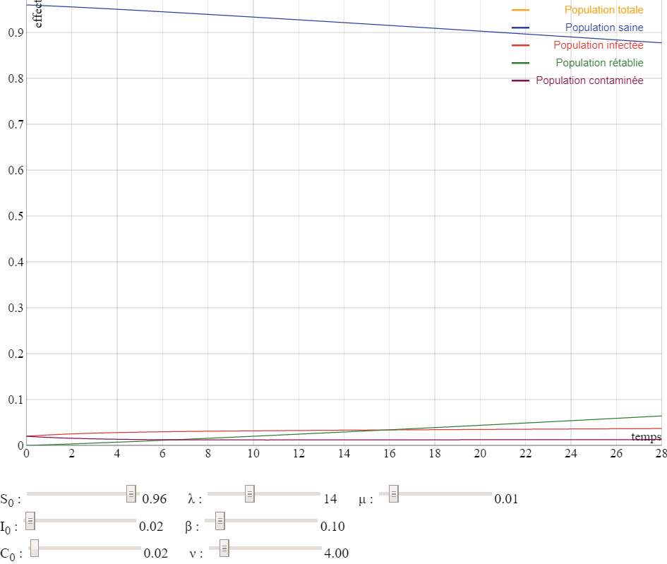

<h1>Etude du Covid19 en France par Machine Learning</h1>

Par Cyril Vincent

Etant expert en IA et Machine Learning, j'ai mener une étude disponible sur le site santepubliquefrance.fr

Evidement je ne suis pas médecin donc cet étude ne vos rien

J'ai téléchargé et nettoyé les données sur https://coronavirus.politologue.com/coronavirus-france.FR 

J'ai utilisé le framewrok Scikit-Learn pour analyser les données. Il était impossible d'utiliser Keras car le nombre de données est trop faible

J'ai également utilisé le modèle SCIR, dispo sur https://interstices.info/modeliser-la-propagation-dune-epidemie

J'ai créer 5 modèles en incluant les données de :
    <ul>
        <li>à partir de J0 : le premier cas est diagnostiqué le 24/01, le modèle est peu fiable car les données de départ sont constantes</li>
        <li>à partir de 10 cas (J15) : le modèle est encore trop peu fiable car le stade 1 de l'épidémie en France était trop différent du stade 2</li>
        <li>à partir du jour 41, la veille de jour où l'épidémie commence à décoller, passage de 92 à 276 cas</li>
        <li>à partir du 1er jour du confinement, le jour 56</li>
        <li>le modèle de propagation SCIR pour l'après déconfinement</li>
    </ul>

Ces deux derniers modèles sont assez fiables, les meilleurs résultats sont obtenus avec le dernier modèle obtenu avec une régression polynomiale de degrés 4

En date du 24/04

A la date du déconfinement le 11 mai (J128)
<ul>
    <li>le nombre de nouveaux cas sera quasi nul!</li>
    <li>Il y aura 150000 cas confirmés</li>
    <li>Il y aura 23000 morts</li>
    <li>Il y aura 4.4 millions de personnes infectées</li>
    <li>Le taux d'infection sera de 7%</li>
</ul>

En Auvergne Rhône-Alpes à la date du déconfinement le 11 mai (Jour 128)
<ul>
    <li>le nombre de nouveaux cas sera quasi nul!</li>
    <li>Il y aura 1200 morts</li>
    <li>Il y aura 0.3 millions de personnes infectées</li>
    <li>Le taux d'infection sera de 3%</li>
</ul>
D'après les différents scenarios de modélisation, il y a 3 possibilités dans les mois à venir :
<ul>
    <li>Scénario optimiste: Comme le SRAS, le virus disparait en Juin</li>
    <li>Scénario pésimiste, le déconfinement est un échec, la 2ème vague reprend 26 jours après soit début Juin avec un confinement mi-juin</li>
    <li>Scénario médian, l'été va nous aider, les mesures de détection vont fonctionner, la 2ème vague surviendra vers Octobre-Novembre avec une intensité moins forte que la 1ère</li>
</ul>
Ci dessous le scénario péssimiste et médian

    

