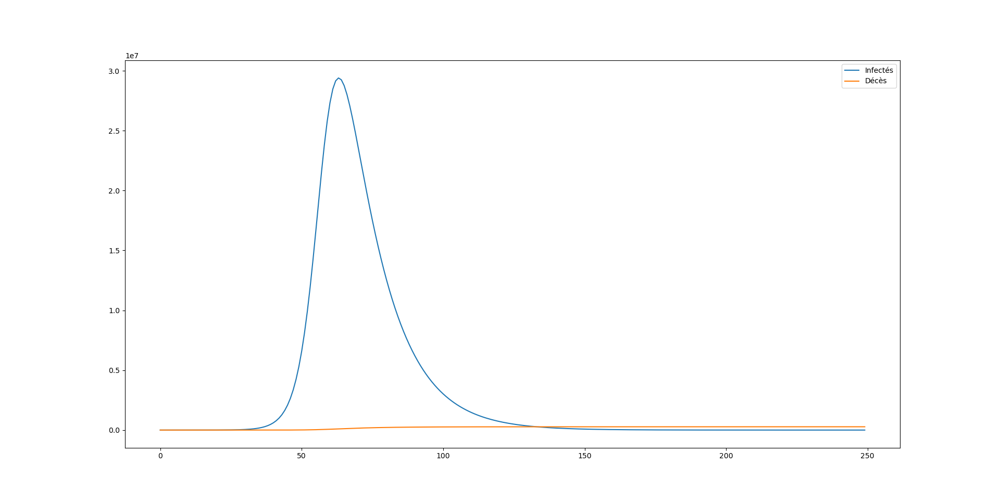

<h1>Etude du Covid19 en France par Machine Learning</h1>

Par Cyril Vincent

Etant expert en IA et Machine Learning, j'ai mener une étude disponible sur le site santepubliquefrance.fr

Evidement <b>je ne suis pas médecin</b> donc cette étude ne vos rien!!

J'ai téléchargé et nettoyé les données sur https://coronavirus.politologue.com/coronavirus-france.FR 

J'ai utilisé le framewrok Scikit-Learn pour analyser les données. Il était impossible d'utiliser Keras car le nombre de données est trop faible

J'ai également utilisé le modèle SCIRE, dispo sur https://interstices.info/modeliser-la-propagation-dune-epidemie

J'ai créer 5 modèles en incluant les données de :
    <ul>
        <li>à partir de J0 : le premier cas est diagnostiqué le 24/01, le modèle est peu fiable car les données de départ sont constantes</li>
        <li>à partir de 10 cas (J15) : le modèle est encore trop peu fiable car le stade 1 de l'épidémie en France était trop différent du stade 2</li>
        <li>à partir du J41, la veille du jour où l'épidémie commence à décoller, passage de 92 à 276 cas</li>
        <li>à partir du 1er jour du confinement, J56</li>
        <li>le modèle de propagation SCIRE pour l'après déconfinement</li>
    </ul>

Ces deux derniers modèles sont les plus fiables, les meilleurs résultats sont obtenus avec avec une régression polynomiale de degrés 4 et un SCIRE

En date du 24/04

Sans confinement, ni mesure de distanciation, les chiffres étaient catastrophiques

Ci dessous l'état des lieux à la date du confinement d45 qui permete d'établire SCIRE.Beta = 0.22

Le scénario suivant se serait alors produit

<ul>
    <li>1.3 millions d'infection</li>
    <li>0.5 millions de décès en 250 jours avec le nombre de lit en réanimation adéquat</li>
    <li>0.75 millions de décès en 250 jours pour 5000 lits de réanimation</li>
    <li>Une pointe à 13000 morts en une journée avec le nombre de lit en réanimation nécessaire</li>
    <li>Une pointe à 19000 morts en une journée pour 5000 lits de réanimation</li>
    <li></li>
</ul>

A la date du déconfinement le 11 mai (J128), le modèle ML nous donne des chiffres assez optimistes mais avec <b>une RValue (score) trop faible pour que ces chiffres soient fiables</b>
<ul>
    <li>le nombre de nouveaux cas sera quasi nul!</li>
    <li>Il y aura 150000 cas confirmés</li>
    <li>Il y aura 23000 décès</li>
    <li>Il y aura 4.4 millions de personnes ayant été infectées</li>
    <li>Le taux d'infection sera de 7%</li>
</ul>

En Auvergne Rhône-Alpes à la date du déconfinement le 11 mai (Jour 128)
<ul>
    <li>le nombre de nouveaux cas sera quasi nul!</li>
    <li>Il y aura 1200 décès</li>
    <li>Il y aura 0.3 millions de personnes ayant été infectées</li>
    <li>Le taux d'infection sera de 3%</li>
</ul>

Au déconfinement, le modèle SCIRE nous propose 3 scénarios

Scénario optimiste: Comme le SRAS, le virus quasi disparait, SCIRE.Beta = 0.01
    <ul>
        <li>Un pic d'infection très bref à j+5, puis le virus quasi disparait à J+60</li>
        <li>23000 décès</li>
    </ul>
    

Scénario pessimiste: le confinement est un échèc, SCIRE.Beta inchangé
    <ul>
        <li>Reconfinement à J+23</li>
        <li>Un énorme pic d'infection à j+50 si aucun reconfinement</li>
        <li>40000 décès avec reconfinement, 500000 sans</li>
    </ul>
    

Scénario médian: les mesures de protection fonctionnent, SCIRE.Beta est divisé par 4
    <ul>
        <li>Un second pic à J+8 puis un 3ème en Octobre - Novembre</li>
        <li>44000 décès sur 250 jours</li>
        <li>2 fois plus de personnes contaminées mais sur 7 mois</li>
        <li>Un taux d'immunisation de 14% en fin d'année</li>
    </ul> 

Il faudra attendre 2.5 à 3 ans pour atteindre l'immunité collective situé autour de 60% de la population ayant été infectée par le virus

    

