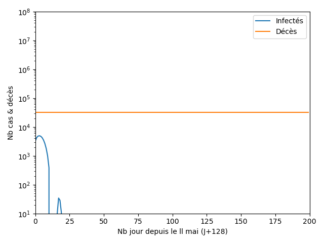
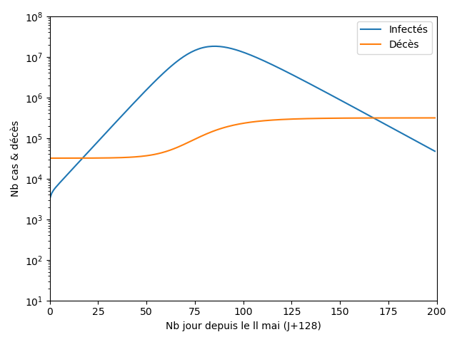

<h1>Etude du Covid19 en France par Machine Learning</h1>

Par Cyril Vincent

Etant expert en IA et Machine Learning, j'ai mené une étude sur les données COVID disponible sur le site santepubliquefrance.fr

Evidement <b>je ne suis pas médecin</b> donc cette étude ne vaut rien!!

J'ai téléchargé et nettoyé les données sur https://coronavirus.politologue.com/coronavirus-france.FR 

J'ai utilisé le framework Scikit-Learn pour analyser les données. Il était impossible d'utiliser Keras car le nombre de données est trop faible

J'ai également programmé le modèle SCIRE d'après https://interstices.info/modeliser-la-propagation-dune-epidemie

Le tout a été programmé en 4h

Ces modèles existent depuis + de 10 ans et toutes les données du SCIRE étaient déjà disponible avant la mi-février

J'ai créé 4 modèles en incluant les données :
    <ul>
        <li>à partir de J0 : le premier cas est diagnostiqué le 24/01, le modèle est peu fiable car les données de départ sont constantes</li>
        <li>à partir de 10 cas (J15) : le modèle est encore trop peu fiable car le stade 1 de l'épidémie en France était trop différent du stade 2</li>
        <li>à partir du J41, la veille du jour où l'épidémie commence à décollée, passage de 92 à 276 cas</li>
        <li>à partir du 1er jour du confinement, J56</li>
    </ul>

J'ai ensuite créé les modèles SCIRE et Machine Learning (ML) avec une regréssion polynômiale ridge de degré 4.

En date du 24/04

Sans confinement, ni mesure de distanciation, les chiffres sont catastrophiques

Ci dessous l'état des lieux à la date du confinement J45 qui permet de trouver R0 = 4.2 au lieu de 3.3 admis aujourd'hui, le virus serait donc 25% plus virulent suivant mon modèle

Sans mesure de protection, le scénario suivant se serait alors produit

<ul>
    <li>1.3 millions d'infection</li>
    <li>0.5 millions de décès en 250 jours avec le nombre de lit en réanimation adéquat</li>
    <li>0.75 millions de décès en 250 jours pour 5000 lits de réanimation</li>
    <li>Une pointe à 13000 morts en une journée avec le nombre de lit en réanimation nécessaire</li>
    <li>Une pointe à 19000 morts en une journée pour 5000 lits de réanimation</li>
</ul>

A la date du déconfinement le 11 mai (J128), le modèle ML nous donne des chiffres assez optimistes mais avec <b>une RValue (score) trop faible pour que ces chiffres soient fiables</b>
<ul>
    <li>Nombre de nouveaux cas sera quasi nul!</li>
    <li>150000 cas confirmés</li>
    <li>23000 décès</li>
    <li>4.4 millions de personnes ayant été infectées</li>
    <li>Taux d'infection de 7%</li>
</ul>

En Auvergne Rhône-Alpes à la date du déconfinement le 11 mai (Jour 128)
<ul>
    <li>Nombre de nouveaux cas sera quasi nul!</li>
    <li>1200 décès</li>
    <li>0.3 millions de personnes ayant été infectées</li>
    <li>Taux d'infection sera de 3%</li>
</ul>

Au déconfinement, le modèle SCIRE nous propose 4 scénarios

Scénario optimiste: Comme le SRAS, le virus quasi disparait, R=0.01
    <ul>
        <li>D'après le modèle SCIRE, un pic d'infection très bref à j+6, puis le virus disparait assez rapidement à J+50</li>
        <li>D'après le modèle ML, le virus quasi disparait immédiatement</li>
        <li>Entre 23000 et 38000 décès au total</li>
    </ul>
    

Scénario pessimiste: le confinement est un échèc, R=R0
    <ul>
        <li>Reconfinement à J+50</li>
        <li>Un énorme pic d'infection à J+50 si aucun reconfinement</li>
        <li>40000 décès au total avec reconfinement, 500000 sans</li>
    </ul>
    

Scénario médian: les mesures de protection fonctionnent avec 90% de détection, un été protecteur, R=0.5
    <ul>
        <li>Grande divergence entre les modèles</li>
        <li>D'après le modèle SCIRE, un second pic ravageur à la fin de l'été, reconfinement rapide, sans reconfinement 300000 décès au total sur 250 jours</li>
        <li>D'après le modèle ML, un second pic à l'automne 10 fois moins meurtrier avec 30000 décès au total sur 250 jours</li>
    </ul>
    

Scénario médian-pessimiste: les mesures de protection fonctionnent moyennement, R = R0 / 4
    <ul>
        <li>Grande divergence entre les modèles</li>
        <li>D'après le modèle SCIRE, un second pic ravageur à J+50, reconfinement rapide, sans reconfinement 360000 décès au total sur 250 jours</li>
        <li>D'après le modèle ML, un second pic à l'automne, aussi intense que le précédent mais plus étalé, reconfinement possible, 40000 à 50000 décès</li>
    </ul>

La moindre variation d'un paramètre peut complètement modifier l'évolution de l'épidémie, ma conclusion est donc de rester modeste

Il faudra attendre 2.5 à 3 ans pour atteindre l'immunité collective situé autour de 60% de la population ayant été infectée par le virus

    

