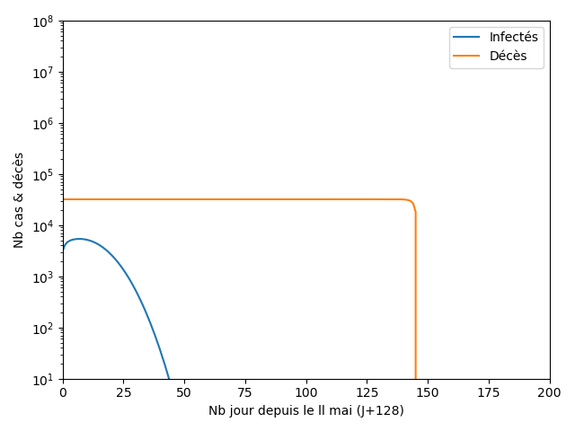

<h1>Etude du Covid19 en France par Machine Learning</h1>

Par Cyril Vincent

Etant expert en IA et Machine Learning, j'ai mené une étude sur les données COVID disponible sur le site santepubliquefrance.fr

Evidement <b>je ne suis pas médecin</b> donc cette étude ne vaut rien!!

J'ai téléchargé et nettoyé les données sur https://coronavirus.politologue.com/coronavirus-france.FR 

J'ai utilisé le framework Scikit-Learn pour analyser les données avec du Machine Learning (ML) et une regréssion polynômiale ridge de degré 4. Il était impossible d'utiliser Keras car le nombre de données est trop faible

J'ai également programmé le modèle SCIRE (Sain-Contaminé-Infecté-Rétablie-Etendue) avec des améliorations d'après https://interstices.info/modeliser-la-propagation-dune-epidemie

<h2>Etude 3: Le déconfinement</h2>

Au déconfinement, le 11 mai (J128), je propose 4 scénarios, pour celà j'ai modifié SCIRE pour ajouter un taux de détection des individus infectés et un taux d'atténuation dû à l'été R = R * DetectionRate * SummerRate, le modèle ML ne peut pas marcher par manque de données

Scénario Marseillais optimiste: Comme le SRAS et comme le propose le professeur Raoult, le virus disparait, R = R0 * 0.1 * 0.1 = 0.03
    <ul>
        <li>Un petit pic arrive à J+5</li>
        <li>Le virus s'éteint entre 0 et 50 jours</li>
        <li>24000 décès au total</li>
    </ul>
    

Scénario Milanais pessimiste: le confinement est un échèc, R=R0, peu probable car ne se produit pas ailleurs dans le monde
    <ul>
        <li>Un énorme pic d'infection à J+50</li>
        <li>40000 décès au total avec reconfinement, 500000 sans</li>
    </ul>
    

Scénario Grenoblois médian: les mesures de protection fonctionnent avec 90% de détection, isolement des patients infectés, protections, un été protecteur, R=R0*0.1*0.5=0.16
    <ul>
        <li>Une petite reprise rapide, un été clément</li>
        <li>Un second pic modeste à l'automne, entre 24000 et 30000 décès en fonction de l'intensité du 2ème pic</li>
    </ul>
    

Scénario Parisien médian-pessiliste : les mesures de détection fonctionnent moyennement à 50%, le reste fonctionne bien et l'été fait son travail, R=R0*0.5*0.5=0.83
    <ul>
        <li>Un pic moyen en Mai, un mois de Juin faussement tranquille</li>
        <li>Un second pic entre Juillet et Novembre, reconfinement possible, + de 50000 décès</li>
    </ul>
    

La moindre variation du paramètre R peut complètement modifier l'évolution de l'épidémie, le ML ne possède pas assez données pour être fiable, il faut donc rester modeste

Conclusion générale : les modèles sont très incertains, une boule de cristale ferait aussi bien, le paramètre R reflète l'interaction entre les personnes, le confinement l'a diminué d'un facteur 7, d'autres mesures comme les protections et les détections massives arrivent à un résultat proche, en mai un petit pic va avoir lieu mais avec un peu de chance l'épidémie va vite refluée si les moyens de détection fonctionnent et sont massifs, le risque de 2ème vague à l'automne est très fort mais peu quantifiable pour le moment.

Comme le montre le sud de la France et l'Afrique, les temps ensoleillés, secs et chauds semblent diminuer fortement R, donc soyons optimiste

Il faudra attendre 2 à 3 ans pour atteindre l'immunité collective situé autour de 60% de la population ayant été infectée par le virus, sauf si un vaccin efficace et disponible arrive avant

<h2>Etude 2 : Le confinement</h2>

En date du 24/4 nous savons que le R0=3.3 est plus optimiste que mon étude 1 et le R à atteint 0.5 soit une baisse d'un facteur 7

Tout d'abord un modèle SCIRE à été mis en place avec un Rmoyen=0.8

Ensuite un modèle ML a été mis en place à partir du 24/4

A la date du déconfinement le 11 mai (J128), le modèle ML nous donne un score trop faible (30%) pour être fiable et le modèle SCIRE est difficile à étudier quand R varie, le taux d'erreur est donc énorme

<ul>
    <li>Le modèle SCIRE prévoit 360000 cas réels par jour, contre 10 pour ML</li>
    <li>150000 cas confirmés</li>
    <li>23000 décès</li>
    <li>4.5 millions de personnes ayant été infectées</li>
    <li>Taux d'infection de 7%</li>
</ul>

En Auvergne Rhône-Alpes à la date du déconfinement le 11 mai (J128)
<ul>
    <li>Le modèle SCIRE prévoit 18000 cas réels par jour, contre 0 pour ML</li>
    <li>1200 décès</li>
    <li>0.3 millions de personnes ayant été infectées</li>
    <li>Taux d'infection de 3%</li>
</ul>

<h2>Etude 1: Sans confinement</h2>

Seul le modèle SCIRE a pu être utilisé car les données étaient insufisantes pour le Machine Learning

Ci dessous l'état des lieux à la date du confinement J45 qui permet de trouver R0 = 4.2

Sans confinement, ni protection, ni mesure de distanciation, les chiffres sont catastrophiques, en prenant comme hypothèse R0 = 4.2, en date de J45 la veille du confinement
<ul>
    <li>3 millions d'infection</li>
    <li>250000 décès en 250 jours avec le nombre de lit en réanimation adéquat</li>
    <li>Au moins 50000 décès supplémentaire par manque de lit</li>
    <li>Une pointe à 15000 morts par jour avec le nombre de lit en réanimation nécessaire</li>
    <li>Une pointe à 20000 morts par jour pour 5000 lits de réanimation</li>
</ul>

  

